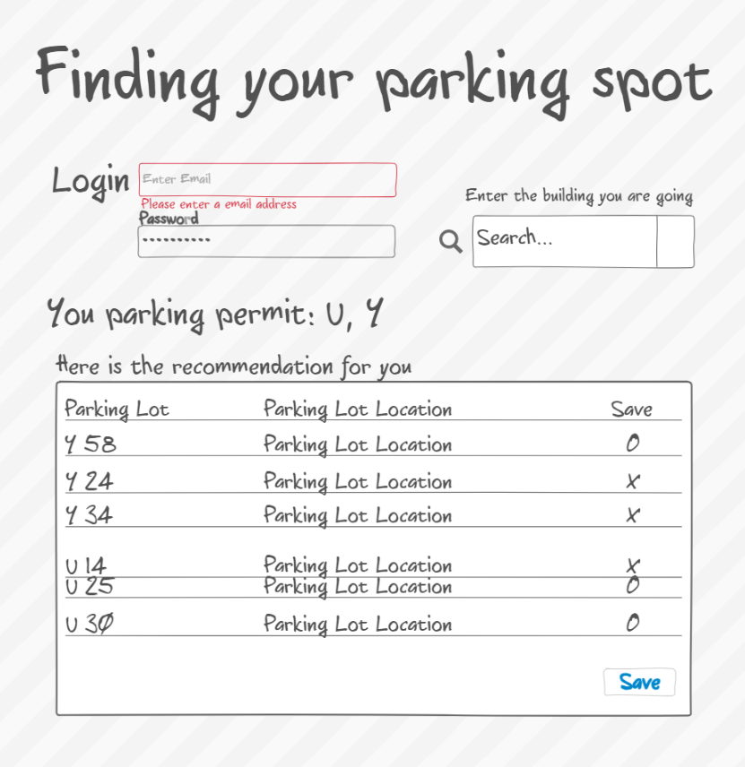

# startup

[notes.md](notes.md)
# --------------------------------------------------

# Finding your pakring spot
## Elevator pitch

### Are you tired of endlessly circling the parking lots at BYU, hoping to find a spot? Introducing the 'Find your Parking Spot' app, your ultimate solution to the campus parking struggle! Our app uses real-time data and advanced algorithms to help you quickly locate available parking spaces on campus, saving you time and reducing stress. 

## Design

## Key Features
- Secure login over HTTPS
- Ability to enter a building
- Display recommended Paking lot with location
- Ability to save the list for future
- Saved list will be persistently stored in database

## Technologies
- HTML - Use correct structure for application. There will be two pages. One for login and one for displaying and searching for parking lots.
- CSS - Aplication styling that makes easiler for users to see and use the application.
- Javascript - Calculating distance from the buildings that user enter to parking lots. So that it can recommend good parking spot for users.
- Service
    - login
    - retrieving buildings
    - submitting parking lots
- DB - Store users, parking spots in database.
- login - Register and login users.
 
 ## CSS deliverable
 For this deliverable I porperly styled the application
 - Header, footer, and main content body
 - Navigation elements - I added login and go back button.
 - Resposive to window resizing - My app can resize as window's size changes
 - Application elements - Used good contrast adn whitespace
 - application text conent - Consistent fonts

 ## JavaScript deliverable
For this deliverable I implemented by JavaScript so that the application works for a single user.

- login - Implement a login functionality that navigates the user to the main application page after successful authentication.
- Database - Use local storage to temporarily hold user data such as saved parking spots. This can be replaced by a database in the future for more robust data management.
- application logic - search for parking lots, calculating distances, and saving parking lots.

## Service deliverable
For this deliverable I added backend endpoints that receives login info and parkingLot elements.
- Node.js/Express HTTP service - done!
- Static middleware for frontend - done!
- Call to third party endponits - done!
- Backend service endpoints - done!
- Frontend calls service endpoints - done!

## DB deliverable
For this deliverable I stored the parkinglots in the database.

- MongoDB Atlas database created - done!
- Endpoints for data - done!
- Stores data in MongoDB - done!

## Login deliverable
For this deliverable I associate the parkinglots with the logged in user.

- User registration - If the username doesn't exist, it autometically create an account with the password
- existing user - Stores the parkinglots under the same user if the user already exists.
- Use MongoDB to store credentials - Stores both user/password and their saved parkingLots.
- Restricts functionality - User can not search or save the parkingLots until the user have logged in.